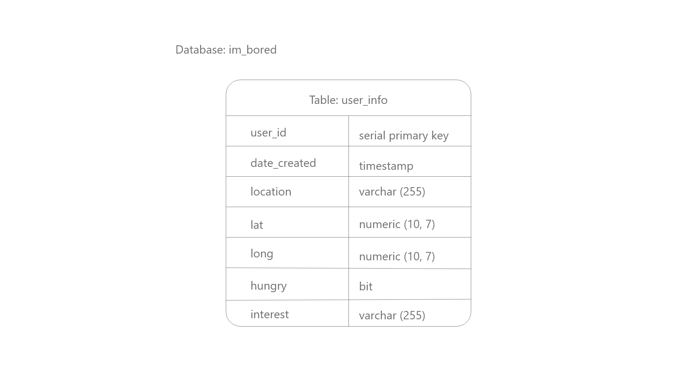
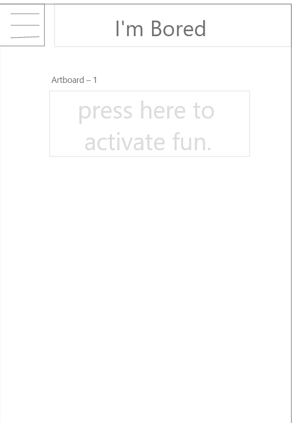
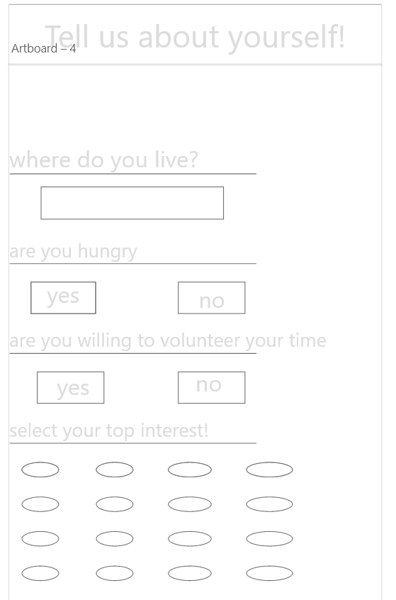
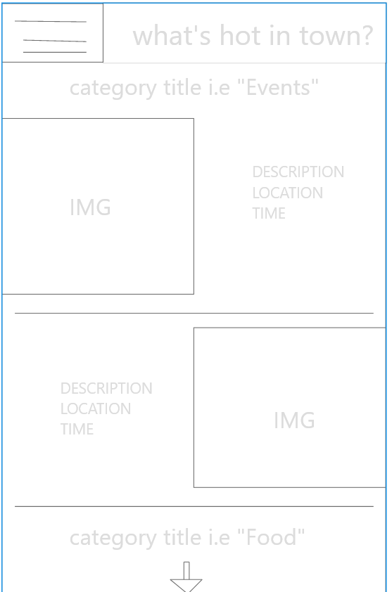

# 301-teamput

Project Name: I'm Bored! An app that suggests things for you to do when you've got nothing else to do.

Group members: Isaac Nelson, Vik Akam, Pete Alba, Laura Antonius

## Database Entity Relationship Diagram

## User Stories
User story #1: As a bored person, I want my app to load quickly so that I can enjoy using the app
User story #2: As a bored person, I want to answer questions about my preferences so that my results are tailored toward me
User story #3: As a bored person, I want to make sure my activities and results are based on my location.
User story #4: As a bored person, I want to see events based on my preferences so that I can go to those events
User story #5: As a bored person, I want to know about music recommendations or trivia so that I can be entertained
User story #6: As a bored person, I want to be able to start the quiz over again to get new results.
User story #7: As a bored person, I want to be able to update my old quiz answers to get new results.
User story #8: As a bored person, I want to know what relevant restaurant options are so that I can eat my boredom away
User story #9: As a bored person, I want to encounter error messages so that I know my app isn't working
User story #10: As a bored person, I want a clean looking UI so that using the app is pleasant.

## Our Wireframe

